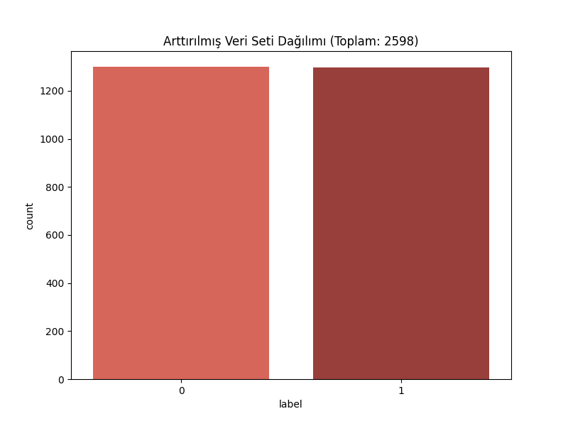
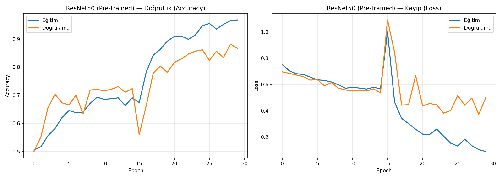
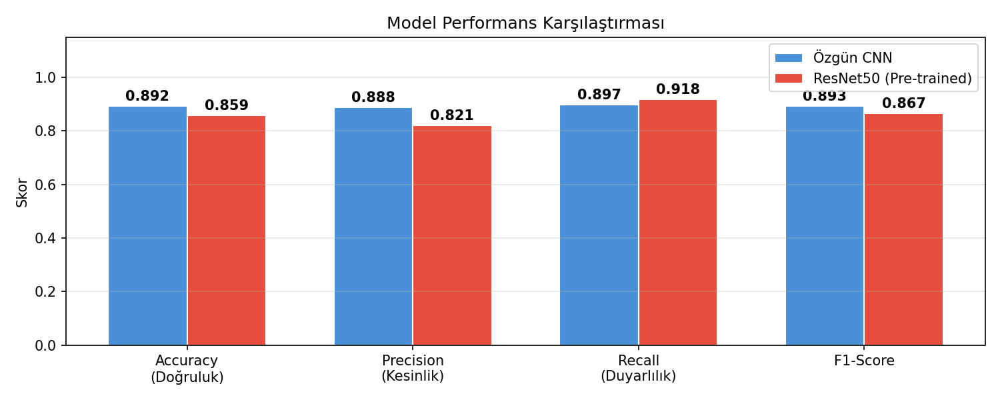

# 🧠 Brain Hemorrhage Analysis with Deep Learning

[](https://www.python.org/)
[](https://tensorflow.org/)
[](https://streamlit.io/)
[](https://opensource.org/licenses/MIT)

This project is a comprehensive Deep Learning solution for detecting brain hemorrhages from CT scans. It features a complete pipeline from data preparation and augmentation to model training using both custom CNN architectures and Pretrained (Transfer Learning) models, culminating in a user-friendly Streamlit web interface.

---

## 🚀 Key Features

- **Automated Data Pipeline**: Cleaning, processing, and augmenting raw CT images.
- **Advanced Training**: 
  - **5-Fold Stratified Cross-Validation** for robust performance estimation.
  - **Custom CNN** and **Pretrained Models** (Transfer Learning) support.
  - **Hyperparameter Optimization** to find the best performing configurations.
- **Data Augmentation**: Enhancing the dataset with rotation, shifts, shears, and flips.
- **Interactive Interface**: A modern Streamlit dashboard for real-time predictions and model visualization.
- **Comprehensive Metrics**: Automatic generation of training logs, confusion matrices, and performance graphs.

---

## 🛠 Tech Stack

- **Deep Learning**: TensorFlow / Keras
- **Computer Vision**: OpenCV
- **Data Handling**: Pandas, NumPy
- **Visualization**: Matplotlib, Seaborn
- **Web App**: Streamlit
- **Environment**: Python (Virtual Environments supported)

---

## 📂 Project Structure

```bash
brain-hemorrhage-analysis-dl/
├── data/                  # Raw and processed datasets
├── modeller/              # Saved .h5 / .keras model files
├── src/                   # Source Code
│   ├── arayuz/            # Streamlit Application (arayuz_app.py)
│   ├── veri_hazirlama.py  # Data cleaning and K-Fold splitting
│   ├── model_egitimi.py   # Training custom architectures
│   ├── pretrained_model.py# Transfer learning implementations
│   ├── hiperparametre_opt.py # Tuning scripts
│   └── web_crawling.py    # Automated data collection
├── rapor_gorselleri/      # Performance graphs and distribution charts
├── baslat_windows.bat     # Windows startup script
└── requirements.txt       # Project dependencies
```

---

## 🔄 Workflow

To reproduce the results or train the model from scratch, follow these steps:

1. **Web Crawling (Optional)**: Collect additional data if needed.
   ```bash
   python src/web_crawling.py
   ```
2. **Data Preparation**: Clean the raw data, perform augmentation, and create 5-Fold splits.
   ```bash
   python src/veri_hazirlama.py
   ```
3. **Hyperparameter Tuning**: Find the optimal configuration.
   ```bash
   python src/hiperparametre_opt.py
   ```
4. **Training**: Train the models using the best parameters.
   ```bash
   python src/model_egitimi.py    # For custom CNN
   python src/pretrained_model.py # For Transfer Learning
   ```
5. **Testing & Metrics**: Evaluate the final performance.
   ```bash
   python src/test_ve_metrikler.py
   ```

---

## 📊 Results & Visualization

### Data Distribution
The project handles class imbalance through strategic augmentation.


### Training Performance
Comparison of accuracy and loss across training epochs for both custom and pretrained models.


### Model Comparison
Analysis of different architectures and their success rates on the test set.


---

## ⚙️ Installation & Usage

### 1. Clone the Repository
```bash
git clone https://github.com/salihkkus/brain-hemorrhage-analysis-dl.git
cd brain-hemorrhage-analysis-dl
```

### 2. Set Up Environment
```bash
# Create a virtual environment
python -m venv venv

# Activate it (Windows)
venv\Scripts\activate

# Install dependencies
pip install -r requirements.txt
```

### 3. Run the Application
You can use the provided batch script or run directly:
- **Windows**: Double-click `baslat_windows.bat`
- **Manual**: `streamlit run src/arayuz/arayuz_app.py`

---

## 📝 License
Distributed under the MIT License. See `LICENSE` for more information.

---

## 👥 Authors
Developed as part of a University Project.
- [Salih Karakuş](https://github.com/salihkkus)
- *Collaborators listed in the project report.*

---
*Note: This project is for educational purposes. For medical diagnosis, always consult professional healthcare providers.*
